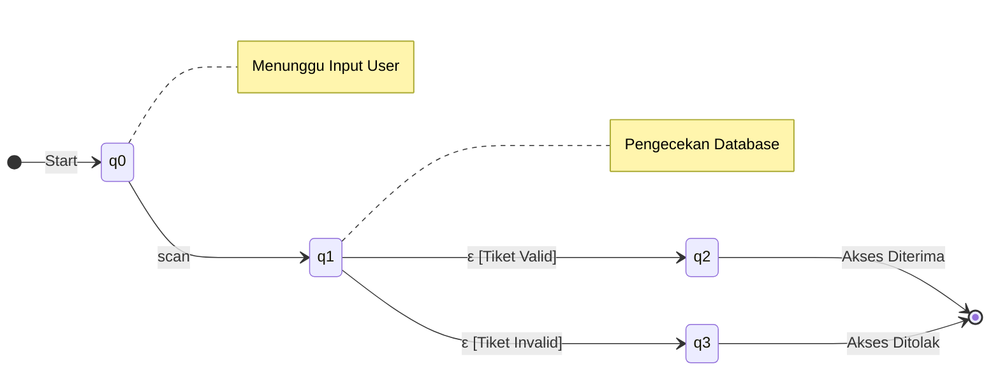

# Laporan Dokumentasi Sistem Validasi Tiket Event
## Implementasi Non-Deterministic Finite Automata (NFA) dengan ε-move

### 1. Definisi Sistem
**EventHub Validation System** adalah aplikasi berbasis web yang dirancang untuk memvalidasi tiket masuk acara secara otomatis. Sistem ini menggunakan logika komputasi berbasis automata untuk menentukan validitas tiket berdasarkan input pengguna dan data yang tersimpan.

Model yang digunakan adalah **Non-Deterministic Finite Automata (NFA) dengan &epsilon;-move**. Penggunaan &epsilon;-move memungkinkan sistem untuk melakukan transisi status secara otomatis (internal check) setelah menerima input awal, tanpa memerlukan interaksi tambahan dari pengguna.

---

### 2. Spesifikasi Formal Automata
Model NFA didefinisikan sebagai 5-tuple $(Q, \Sigma, \delta, S, F)$:

1.  **Himpunan State ($Q$)**:
    *   $q_0$: State awal (Standby/Menunggu Input).
    *   $q_1$: State proses (Processing/Pengecekan Database).
    *   $q_2$: State akhir diterima (Access Granted/Valid).
    *   $q_3$: State akhir ditolak (Access Denied/Invalid).

2.  **Alfabet Input ($\Sigma$)**:
    *   $\Sigma = \{ \text{"scan"} \}$

3.  **State Awal ($S$)**:
    *   $S = q_0$

4.  **Himpunan State Akhir ($F$)**:
    *   $F = \{ q_2, q_3 \}$

5.  **Fungsi Transisi ($\delta$)**:
    *   $\delta(q_0, \text{"scan"}) \to q_1$
    *   $\delta(q_1, \epsilon) \to q_2$ (Jika tiket valid & status 'Siap Pakai')
    *   $\delta(q_1, \epsilon) \to q_3$ (Jika tiket tidak valid, 'Terpakai', atau 'Belum Terjual')

---

### 3. Diagram State Automata
Berikut adalah representasi diagram transisi sistem menggunakan notasi Mermaid:

*Keterangan:*
*   **q0**: Sistem siap menerima input.
*   **q1**: Sistem memproses kode tiket. Transisi keluar dari $q_1$ bersifat otomatis ($\epsilon$-move) bergantung pada kondisi data.
*   **q2**: Keputusan akhir diterima.
*   **q3**: Keputusan akhir ditolak.

---

### 4. Alur Proses Sistem
1.  **Inisialisasi ($q_0$)**:
    Sistem berada dalam kondisi *idle*, menunggu pengguna memasukkan kode tiket atau melakukan pemindaian (scan).

2.  **Input Data ($\delta: q_0 \to q_1$)**:
    Pengguna menekan tombol "VALIDASI". Sistem menerima token input "scan" dan berpindah ke state pemrosesan ($q_1$).

3.  **Proses Internal ($\epsilon$-Transition)**:
    Pada state $q_1$, sistem melakukan pencarian data tiket di database secara *asynchronous*. Tidak ada input eksternal yang dibutuhkan.
    *   Sistem memeriksa apakah kode tiket ada di tabel `tickets`.
    *   Sistem memeriksa status tiket (`sold`, `used`, atau `available`).

4.  **Keputusan Akhir**:
    *   **Jalur Terima ($q_1 \to q_2$)**: Jika kode ditemukan DAN statusnya `sold` (Siap Pakai). Sistem menampilkan pesan "ACCESS GRANTED" dan mengubah status tiket menjadi `used`.
    *   **Jalur Tolak ($q_1 \to q_3$)**:
        *   Jika kode tidak ditemukan.
        *   Jika status `used` (sudah dipakai sebelumnya).
        *   Jika status `available` (belum dibayar/diaktifkan).
        Sistem menampilkan pesan "ACCESS DENIED".
