# EventHub Validation System 🎫

Sistem validasi tiket event sederhana berbasis web yang menerapkan konsep **Non-Deterministic Finite Automata (NFA) dengan ε-move**. Proyek ini dibuat untuk memenuhi tugas Teori Bahasa dan Automata.

## 📌 Definisi Sistem

**EventHub Validation System** adalah aplikasi simulasi untuk memvalidasi tiket masuk sebuah acara. Sistem ini berfungsi untuk mengecek apakah kode tiket yang dimasukkan oleh pengguna valid, sudah digunakan, atau tidak terdaftar.

Logika inti dari sistem ini tidak menggunakan *backend* konvensional, melainkan dimodelkan menggunakan mesin automata status terbatas (Finite State Machine). Sistem memisahkan fase "Input" dan fase "Keputusan Logis" menggunakan transisi otomatis (epsilon-move).

## 🧠 Model Automata (NFA-ε)

Model yang digunakan adalah **Non-Deterministic Finite Automata (NFA) dengan ε-move**.
Penggunaan **ε-move** (epsilon transition) memungkinkan sistem untuk berpindah state secara otomatis tanpa memerlukan input tambahan dari pengguna setelah proses scanning selesai untuk menentukan hasil validasi.

### Definisi Formal (5-Tuple)
Mesin didefinisikan sebagai $M = (Q, \Sigma, \delta, S, F)$ dimana:

*   **$Q$ (Himpunan State)**:
    *   `q0`: Start / Standby (Menunggu input scan)
    *   `q1`: Processing (Proses pengecekan di database internal)
    *   `q2`: Accept State (Akses Diterima - Tiket Valid)
    *   `q3`: Reject State (Akses Ditolak - Tiket Invalid/Terpakai)

*   **$\Sigma$ (Alfabet Input)**:
    *   `"scan"` (Sinyal yang dikirim saat tombol validasi ditekan)

*   **$S$ (State Awal)**: `q0`

*   **$F$ (State Akhir)**: `{q2, q3}`

*   **$\delta$ (Fungsi Transisi)**:
    1.  $\delta(q0, \text{"scan"}) \to q1$
    2.  $\delta(q1, \epsilon) \to q2$ (Jika tiket ditemukan di database & status 'sold')
    3.  $\delta(q1, \epsilon) \to q3$ (Jika tiket tidak ditemukan atau status 'used'/'available')

## 📊 Diagram Automata

Berikut adalah visualisasi diagram transisi state dari sistem ini:

```mermaid
stateDiagram-v2
    direction LR
    
    [*] --> q0: Start
    q0 --> q1: "scan"
    note right of q0: User menekan tombol Validasi
    
    q1 --> q2: ε (Otomatis)
    note right of q1: Cek Database Internal
    
    q1 --> q3: ε (Otomatis)
    
    q2 --> [*]: ACCESS GRANTED
    q3 --> [*]: ACCESS DENIED
    
    note right of q2: Tiket Valid
    note right of q3: Tiket Invalid / Terpakai
```

## 🔄 Alur Proses

1.  **Input ($q_0 \to q_1$)**:
    *   Pengguna memasukkan kode tiket pada antarmuka web.
    *   Pengguna menekan tombol **VALIDASI**.
    *   Sistem menerima input tersebut sebagai token "scan" dan berpindah dari state standby ($q_0$) ke state processing ($q_1$).

2.  **Proses Internal ($q_1$)**:
    *   Di state ini, sistem melakukan simulasi pencarian data secara *asynchronous* (terdapat *delay* visual).
    *   Sistem memeriksa array `tickets` di JavaScript local storage.

3.  **Keputusan ($\epsilon$-Transition)**:
    *   Mesin melakukan transisi otomatis (ε-move) berdasarkan hasil pencarian:
        *   **Ke $q_2$ (Terima)**: Jika kode tiket ada DAN statusnya 'Siap Pakai' (*Sold*). Sistem kemudian menandai tiket tersebut menjadi 'Terpakai' (*Used*).
        *   **Ke $q_3$ (Tolak)**: Jika kode tiket tidak ada, atau statusnya sudah 'Terpakai' (*Used*), atau tiket 'Belum Terjual' (*Available*).

## 🚀 Cara Menjalankan

Karena sistem ini berbasis **Client-Side JavaScript** murni (HTML/CSS/JS):

1.  Pastikan Anda memiliki file `index.html`, `style.css`, dan `script.js`.
2.  Cukup buka file **`index.html`** menggunakan browser modern (Chrome, Edge, Firefox).
3.  Tidak perlu instalasi server atau `npm`.

## 📂 Struktur Data Tiket

Contoh data tiket dalam simulasi:
*   `VIP-GALA-001` (Status: Sold) -> **Diterima**
*   `REG-FEST-055` (Status: Sold) -> **Diterima**
*   `EARLY-BIRD-1` (Status: Used) -> **Ditolak** (Sudah dipakai)
*   `REG-FEST-056` (Status: Available) -> **Ditolak** (Belum dibayar/dijual)

---
*Dibuat untuk Tugas Sistem Validasi Tiket Event (NFA Implementation)*
